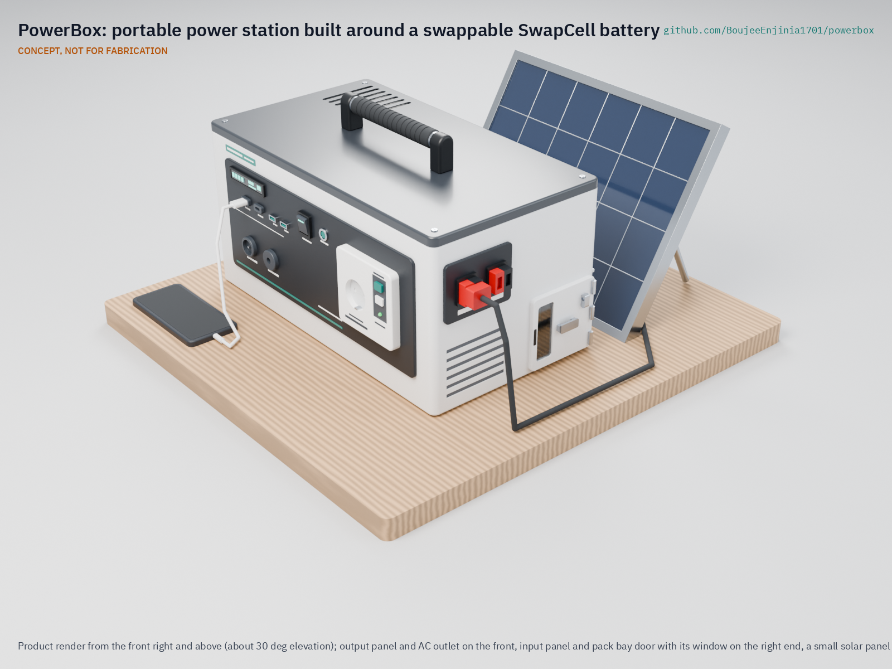

# PowerBox

     

**Area:** CleanTech · **TRL:** 3 of 9 (proof of concept on paper) · **Prototype budget:** $450 USD, excluding the shared SwapCell pack · **Difficulty:** 3 of 5

Standalone multi-input power station built around a SwapCell battery pack. It charges from a solar panel, the grid or a SunSpoke bike, and powers devices through USB, 12 V DC and a small AC outlet. It never connects to household wiring.

[Exploded render](media/render-exploded.png) · [Detail render](media/render-detail.png) · [Interactive 3D model](media/viewer.html) · [Concept blueprint (PDF)](media/concept-blueprint.pdf) · [Review note](docs/REVIEW.md)

## Concept rationale

A power station is only as useful as its battery, and in most commercial units the battery is sealed in. PowerBox is built around the portfolio's shared SwapCell pack instead, so the same battery can charge on a SunSpoke e-bike, a SwapCell dock or a solar panel and then run lights, phones, a radio and a router at home. A worn pack is replaced rather than the whole box. The box has no AC inlet and grid charging goes through a certified external charger, so it cannot back-feed household wiring through an ordinary plug.

The design is open and garage-buildable because the households that need it most are often the ones least served by sealed, imported products. A folded aluminium case, off-the-shelf certified modules for everything at mains voltage and a documented BOM mean a local technician can build, diagnose and repair it, and a community charging point can swap packs between boxes.

## Burning platform

In 2023 more than 666 million people still had no access to electricity, 85 % of them in sub-Saharan Africa ([WHO, IEA, IRENA, UNSD, World Bank, *Tracking SDG 7*, 2025](https://www.who.int/news/item/25-06-2025-energy-access-has-improved--yet-international-financial-support-still-needed-to-boost-progress-and-address-disparities)). Many more are connected but cannot rely on the grid: South Africa had load shedding on 290 days and for 6,948 hours in 2023, its worst year on record ([CSIR, 2025](https://www.csir.co.za/sites/default/files/2025-09/Utility%20Statistics%20Report_Jan%202025_Final.pdf)).

Rich grids fail too, and long outages fall hardest on poorer households. After Hurricane Maria in 2017, Puerto Rico lost an estimated 3.9 billion customer hours of electricity, the longest blackout in US history, and low-income residents waited longest for power to return ([Román et al., *PLOS ONE*, 2019](https://journals.plos.org/plosone/article?id=10.1371%2Fjournal.pone.0218883)).

## Where it could be used

### By industry

| Industry | Use |
| --- | --- |
| Households | Evening light, phone charging, radio and home internet through outages, recharged from solar or the grid |
| Community charging and small retail | Phone and lamp charging for a fee at market stalls and kiosks, with packs swapped between boxes and a dock |
| Humanitarian and disaster response | Quiet, fume-free power in shelters and homes after storms, earthquakes and grid attacks |
| Last-mile e-mobility | A home end for SunSpoke and other SwapCell vehicles, so a ridden pack powers the house at night |
| Education and training | A teaching platform for batteries, MPPT, inverters and electrical safety in schools and makerspaces |
| Electronics repair trade | An open, standard-parts design that local technicians can build, service and adapt |

### By country or region

| Country or region | Why it matters there |
| --- | --- |
| Nigeria | About 40 % of people lacked electricity access in 2023, and connected households saw about seven outages a week ([World Bank, *Atlas of Global Development*](https://data360.worldbank.org/en/atlas/electricity-access/)) |
| Democratic Republic of the Congo | About 80 % of the population lacked electricity access in 2023 ([World Bank, *Atlas of Global Development*](https://data360.worldbank.org/en/atlas/electricity-access/)) |
| South Africa | Load shedding on 290 days in 2023 ([CSIR, 2025](https://www.csir.co.za/sites/default/files/2025-09/Utility%20Statistics%20Report_Jan%202025_Final.pdf)) |
| Ukraine | Attacks destroyed about 9 GW of generating capacity by 2024, and some cities had blackouts of 12 h or more a day that summer ([UN Human Rights Monitoring Mission in Ukraine, 2024](https://ukraine.ohchr.org/en/Attacks-On-Ukraines-Electricity-Infrastructure)) |
| Puerto Rico (United States) | Hurricane Maria caused the longest blackout in US history, with rural municipalities averaging 131 days without power ([Román et al., 2019](https://journals.plos.org/plosone/article?id=10.1371%2Fjournal.pone.0218883)) |
| Japan | The 2018 Hokkaido Eastern Iburi earthquake cut power to about 2,950,000 homes across almost all of Hokkaido ([Japanese Red Cross Society](https://www.jrc.or.jp/english/relief/2020/0804_009751.html)) |

## What sparked the idea

The starting point was Winter Storm Uri in February 2021, when much of Texas lost power for days in freezing weather. The Texas Department of State Health Services counted 246 storm-related deaths, including 19 fatal carbon monoxide poisonings from improper use of generators, grills and heating equipment ([Texas DSHS, 2021](https://www.dshs.texas.gov/sites/default/files/news/updates/SMOC_FebWinterStorm_MortalitySurvReport_12-30-21.pdf)). The fuel-burning fallbacks that households reach for in an outage can be deadly indoors. That points at a silent battery box with no combustion and no way to back-feed the house, sized realistically for lights, phones, radio and internet, and charged from whatever is at hand.

## Problem

When the power goes out, households need a small, safe store of electricity for lights, phones, radio and internet, charged from whatever source is available: a solar panel, the grid when it is up or a charged pack brought home from an e-bike. Design with, not for: requirements must come from co-design sessions and field trials with the intended users through a local partner.

## Concept

Standalone multi-input power station built around a SwapCell battery pack. It charges from a solar panel, the grid or a SunSpoke bike, and powers devices through USB, 12 V DC and a small AC outlet. It never connects to household wiring.

It builds to SwapCell interface v0.3 as a station host: it wakes the pack through a coded INTERLOCK loop and can run loads while charging from solar. The sizing note shows 419 Wh usable per pack, 1.87 evenings of the reference load (short of the two-evening target), a 2.1 h grid charge, 8.6 kg with the pack and $449 of PowerBox parts.

Full design precis: [docs/02-concept.md](docs/02-concept.md) · Sizing: [docs/04-calcs/01-sizing.md](docs/04-calcs/01-sizing.md) · General arrangement: [cad/drawings/PBX-DWG-001.pdf](cad/drawings/PBX-DWG-001.pdf)

## Key components

- Removable SwapCell 48 V pack (interface v0.3), with a fixed 12.8 V LiFePO4 pack as a documented fallback
- Multi-input charge controller (12 to 60 V DC and solar input with MPPT, external certified charger)
- USB-A and USB-C PD outlets
- 12 V DC outlets from a 30 A buck converter
- 300 W, 230 V pure sine inverter with its own AC outlet behind a 30 mA RCD
- State-of-charge display
- Enclosure with ventilation and handles

The working bill of materials is in [bom/bom.csv](bom/bom.csv).

## Safety

> Standalone use only: never connect the AC output to a wall outlet or household wiring, because back-feeding endangers utility workers and is illegal. Contains a lithium battery pack. Use a BMS with cell-level protection, fuse the pack, and charge on a non-combustible surface.

## Repository layout

| Folder | Contents |
| --- | --- |
| `docs/` | Problem, concept, requirements, calculations and design decisions |
| `cad/src/` | build123d Python source, the source of truth for all geometry |
| `cad/step/`, `cad/stl/` | Exported models for FreeCAD, other CAD tools and printing |
| `cad/drawings/` | 2D sketches and dimensioned drawings |
| `bom/` | Bill of materials |
| `electronics/` | KiCad schematics and PCB layouts |
| `firmware/` | Microcontroller code |
| `media/` | Renders, perspectives and photos |
| `build-log/` | Dated prototyping notes |

## Documentation

Controlled documents follow the portfolio [documentation standard](.kit/STANDARDS.md). Each carries a document ID (PBX-PRC-001 for the precis), a version and a revision history. Branded PDFs are built with `python .kit/render.py` and attached to GitHub Releases when a document is tagged, for example `PBX-PRC-001/v1.0`.

## Credits

Designed by Amish Chadha. See [CONTRIBUTORS.md](CONTRIBUTORS.md) for roles. To cite this design, use [CITATION.cff](CITATION.cff) (GitHub shows it as "Cite this repository").

AI assistance (Claude) was used to accelerate concept renders, prototype documentation and first-pass sizing calculations. Design direction and all decisions are Amish Chadha's, recorded in this repository's decision records (`docs/decisions/`).

## Licenses

- **Hardware** (CAD, drawings, BOM, electronics): [CERN-OHL-S v2](LICENSE)
- **Software** (firmware, scripts, notebooks): [MIT](LICENSE-SOFTWARE)

A project of the [Design Molecule](https://designmolecule.com) lab.
