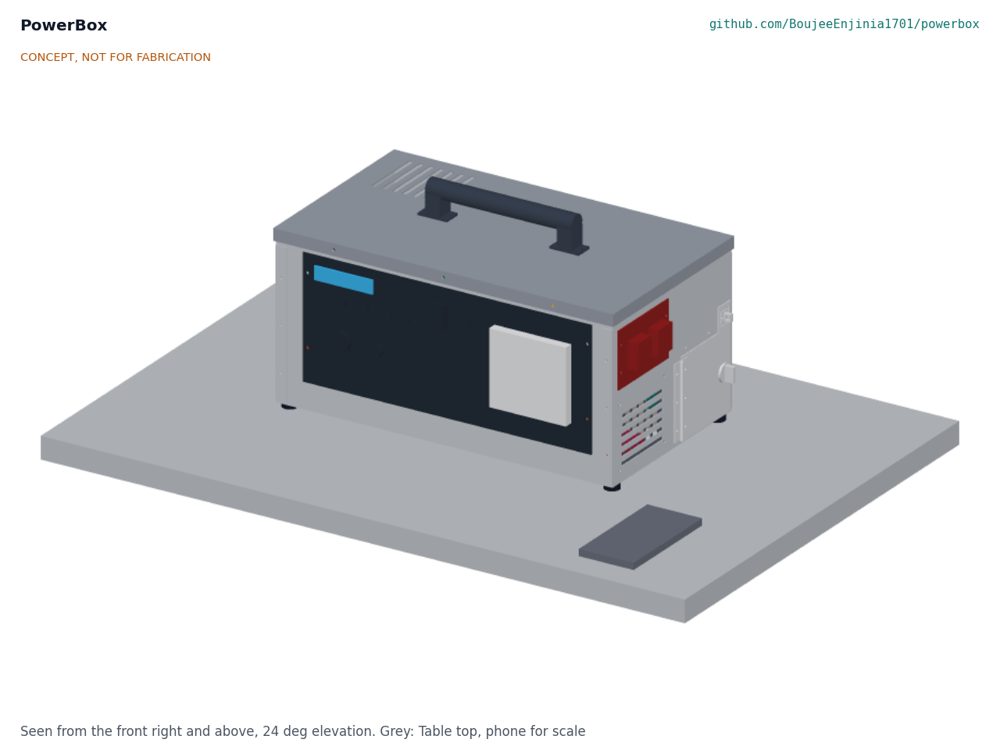
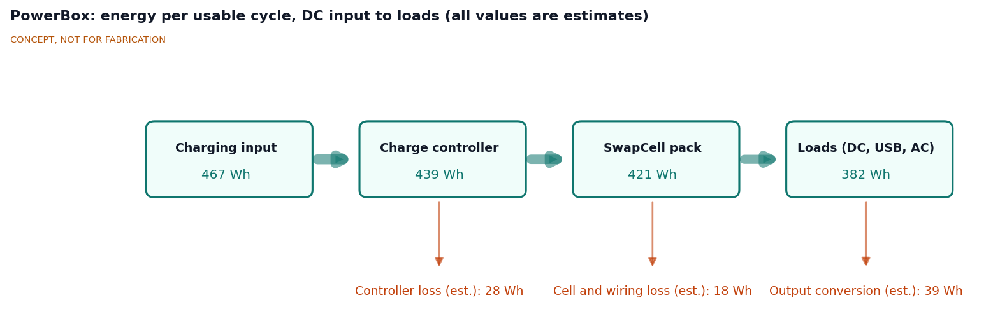
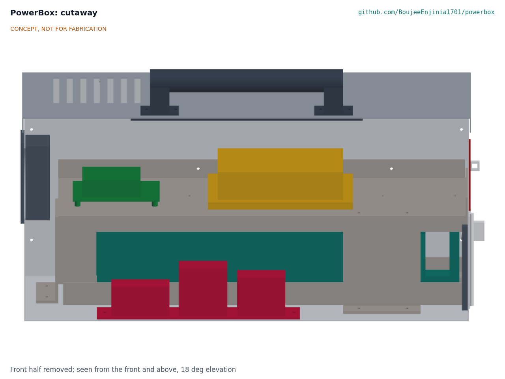
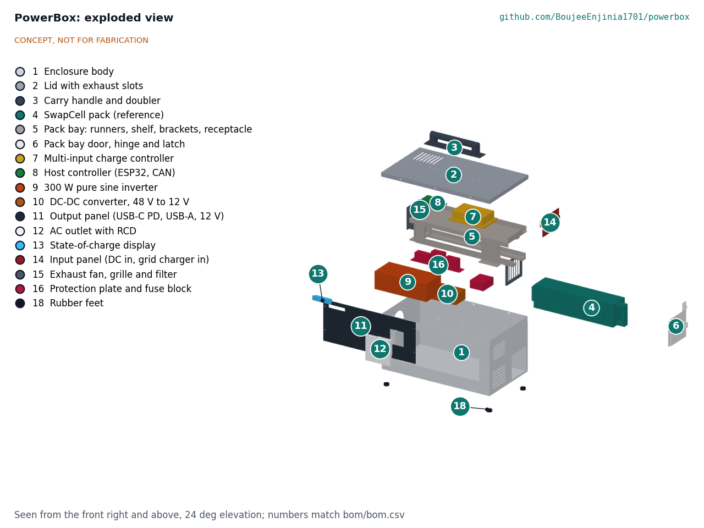

# PowerBox design precis

PowerBox is an aluminium carry case about the size of a small toolbox (460 x 260 x 220 mm body, 480 x 279 x 275 mm overall) with a SwapCell pack sliding into a bay through an end door. A charge controller takes DC from a solar panel, a certified external charger takes grid power, and a charged pack from a SunSpoke bike can simply be swapped in. Power leaves through USB-C PD, USB-A, 12 V sockets and one 300 W, 230 V pure sine AC outlet behind a 30 mA RCD. It never connects to household wiring. The sizing note PBX-CAL-001 shows one pack gives 419 Wh usable, which runs the reference evening of lights, phones, radio and a router **1.87 times, short of the two evenings in R2**. The constructable design (PBX-DDR-003) weighs about 9.4 kg with the pack. Value-engineering target: USD 450. Estimated cost of the constructable design: USD 482 without the pack (USD 32 over the target). How to build the prototype is in the build plan PBX-BLD-001.

PowerBox builds to **SwapCell interface v0.3**. It is a station host (item C), so it can run loads while charging from solar; its receptacle carries the 10 kΩ INTERLOCK coding resistor that wakes a sleeping pack (item W); and its bay uses a class D latch catch (item V).

*Figure 1. PowerBox on a table, with a phone for scale. Output panel on the front, input panel and pack bay door on the right end. Rendered from the parametric model `cad/src/model.py`.*

## How it works

1. **Charge.** Energy comes in through one of three paths, all controlled by the host controller:
   - **DC input** (a solar panel or another 12 to 60 V DC source, up to 200 W) goes through a buck-boost charge controller that tracks the source's maximum power point and charges the pack at up to 54.6 V.
   - **Grid** goes through a certified external 54.6 V, 5 A charger brick with a DC plug. PowerBox itself has no AC inlet, so it cannot be plugged into anything that would back-feed.
   - **SunSpoke** charges the pack while riding or at its own 100 W panel. The rider brings the charged SwapCell pack home and swaps it in. SunSpoke's panel can also plug into the DC input directly. StepGen, a walking vehicle, runs on the same SwapCell pack, so a pack can move between PowerBox and StepGen in the same way.
2. **Store.** The SwapCell pack (13S2P lithium-ion, 46.8 V nominal, 468 Wh nameplate) lies on one of its guide faces on floor runners, with its latch face toward the front of the case, and mates through the SwapCell blind-mate connector at the far end of the bay. A class D catch on a bracket at the front of the bay takes the pack's latch pawl, and the closed door stops the handle.
3. **Wake and handshake.** Seating the pack closes the INTERLOCK loop through the receptacle's 10 kΩ coding resistor, which wakes the pack. With no heartbeat after 2 s the pack enters legacy discharge (15 A limit), which powers the host; the host then sends a station heartbeat (host type 3) requesting mode 2 (discharge) or mode 4 (charge-discharge). A pack that fell asleep in the bay is woken with a recessed wake button on the front panel, which briefly opens the INTERLOCK loop.
4. **Convert and deliver.** The 39 to 54.6 V bus feeds a 48 V to 12 V, 30 A buck converter for the 12 V sockets and the USB-C PD and USB-A modules, and a 48 V input, 300 W pure sine inverter for the AC outlet. The inverter is switched in through its own relay and pre-charge resistor.
5. **Charge while in use.** When a source and a load are both present the host requests mode 4 and keeps net charge current at or below 5.0 A. With the grid charger connected (a fixed 5 A), the host limits the solar controller to the present load current.
6. **Inform.** A small display shows state of charge, input and output power and estimated time remaining, read from the pack's CAN messages. The host switches the inverter off after 10 min below 5 W and returns to off after 30 min idle.
7. **Protect.** A 30 A main fuse, a 20 A breaker on the inverter feed, per-output fuses, thermostatic fan control and the pack's own BMS limits guard against faults.

*Figure 2. Energy per usable cycle, DC input to loads, from PBX-CAL-001. All values are estimates: controller 94 %, cell charge 95 %, output conversion for the reference evening mix of 12 V and USB loads.*

## Main components

*Table 1. Main components. Numbers match `bom/bom.csv` and Figure 4.*

| # | Component | Choice | Notes |
| --- | --- | --- | --- |
| 1 | Enclosure body | Folded 1.2 mm aluminium tub, 460 x 260 x 220 mm | Spreads heat and resists fire better than plastic. Decided by Amish, 2026-09-25 |
| 2 | Lid | 1.2 mm aluminium with a 12 mm skirt and exhaust slots at the back | Removable for service |
| 3 | Carry handle | Folding bar handle on the lid, 200 mm span | Rated 15 kg or more |
| 4 | SwapCell pack | SwapCell interface v0.3 reference pack, 468 Wh, 2.85 kg | Priced once in the SwapCell BOM, not here. Removable pack decided by Amish, 2026-09-25 |
| 5 | Pack bay | Printed floor runners with guide lips and a top guide rail (1 mm clearance per side), folded catch bracket with the class D catch, folded 2 mm shelf above, SwapCell receptacle on a floating mount with a 10 kΩ INTERLOCK coding resistor | Horizontal side-loading bay decided by Amish, 2026-09-25 |
| 6 | Pack bay door | Door on the right end, hinged on its front edge, thumb-turn cam latch, padlock hasp and staple (PBX-DDR-003) | Second stop behind the pack handle |
| 7 | Multi-input charge controller | Buck-boost DC-DC, 12 to 60 V in, 200 W, CC-CV output set by the host | One DC input decided by Amish, 2026-09-25; MPPT in host firmware |
| 8 | Host controller | ESP32 with CAN transceiver, relays and current sensors | SwapCell station host; charge control, auto-off, display |
| 9 | Inverter | 300 W pure sine, 48 V input, 600 W for 1 s, 230 V 50 Hz, output isolated so the neutral can be bonded | AC region decided by Amish, 2026-09-25 |
| 10 | DC-DC converter | 48 V to 12 V, 30 A buck | Resized from 20 A by PBX-CAL-001 |
| 11 | Output panel | USB-C PD 100 W and 60 W, 2 x USB-A, 2 x 12 V sockets, main switch, recessed wake button | Front face |
| 12 | AC outlet | Single 230 V outlet behind a 30 mA RCD | Only mains-voltage point on the box |
| 13 | Display | 2.4 in TFT or e-paper | State of charge, power in and out, time left |
| 14 | Input panel | 2 x Anderson Powerpole PP45: DC in, charger in | Right end, above the bay door |
| 15 | Exhaust fan | 80 mm 12 V fan, thermostatic; filtered intake slots on the right end | Pulls air across the case and out of the left end and lid |

Items 16 (protection and wiring), 17 (grid charger brick) and 18 (hardware) are in the BOM but not modelled. The general arrangement is drawing PBX-DWG-001 (`cad/drawings/PBX-DWG-001.pdf`), generated from `cad/src/model.py`.

*Figure 3. Section looking from the front: inverter (9) on the floor at the front, SwapCell pack (4) in its bay at the back, charge controller (7) and host (8) on the shelf above, fan (15) on the left end, input panel (14) and bay door (6) on the right end.*

## Key numbers

All values come from PBX-CAL-001 (`docs/04-calcs/sizing.py`) and are paper estimates. Assumptions: the SwapCell v0.3 reference pack (466 Wh at 0.2C, 39.0 to 54.6 V); 10 to 100 % state of charge; 12 V buck 94 %, USB modules 93 % from 12 V, charge controller 94 % nominal, cell charge 95 %, grid charger 90 %; inverter efficiency and idle draw typical of 48 V, 300 W pure sine units (no datasheet yet).

*Table 2. Energy, charge times, size and cost.*

| Quantity | Value | Basis | Requirement |
| --- | --- | --- | --- |
| Usable energy | 419 Wh (407 Wh with minimum cells) | 90 % of 466 Wh | R1 met (400 Wh) |
| Reference evening (Table 1 of PBX-REQ-001) | 225 Wh from the pack | 165 Wh for 12 V loads at 94 %, 55 Wh for USB at 87 %, 5 Wh host and idle converters over 5 h | |
| Evenings per pack | 1.87 | 419 / 225 | R2 **not met** (target 2) |
| Grid charge, 10 to 100 % | 2.1 h; 492 Wh from the wall | 1.5 h CC at 5 A, then 0.6 h CV; charger 90 % | R4 met (3 h) |
| Solar, 200 W panel | 634 Wh per clear day at the pack; full in 0.70 day | 4.5 peak sun hours, 0.75 derating, 94 % controller | R5 met |
| Solar, SunSpoke 100 W panel | 317 Wh per clear day; one evening in 0.75 day | Same basis | |
| Charge controller efficiency | 90.5 % at 12 V and 200 W; 93 % or more elsewhere from 40 to 200 W | Loss model, no datasheet | R6 at risk |
| Station mode, net charge | 4.48 A worst case; 2.74 A typical with the router | 200 W at 94 % into 42 V; limit 5.0 A | Within the SwapCell limit |
| 12 V bus demand, all DC outputs | 318 W, 26.5 A | 120 W sockets plus 184 W USB at 93 % | 30 A buck (was 20 A) |
| Peak pack current | 11.5 A at 400 W output; 20.9 A during a 1 s inverter surge | At 39.0 V | Within 20 A continuous and 35 A peak |
| Inverter idle, if left on | 192 Wh per day, 46 % of usable | 8 W for 24 h | Auto-off after 10 min (R8) |
| Standby, off | 3.2 % per month | 2.5 % self-discharge plus 100 µA BMS sleep | R8 met (5 %) |
| Standby, ready | 0.6 W, 14.4 Wh per day | ESP32 0.2 W, CAN and BMS 0.2 W, display 0.2 W | R8 met (1.0 W); host returns to off after 30 min idle |
| Heat at full load while charging | 60 W; air rise about 6 K with the fan | Inverter 41 W, buck 6.4 W, controller 12 W, host 1 W | Fan needed |
| Mass | 9.4 kg (20.8 lb) with pack | Pack 2.85, body 1.22, lid 0.47, inverter 1.20, other parts 3.68 kg (constructable design) | R10 met (10 kg); charger brick about 0.8 kg extra |
| Size | 480 x 279 x 275 mm overall | Parametric model | R10 met, 5 mm spare in height |
| PowerBox parts cost | USD 482 | `bom/bom.csv`, indicative prices | Value-engineering target USD 450: USD 32 over |
| Cost with one SwapCell pack | USD 896, for reference | USD 482 plus USD 414 from the SwapCell BOM | Pack excluded from this budget (decided) |

*Table 3. Runtime on one full pack (419 Wh usable) for single loads.*

| Load | Output | Power at the load | Drawn from the pack | Runtime |
| --- | --- | --- | --- | --- |
| Wi-Fi router and fibre terminal | 12 V DC | 12 W | 12.8 W | about 33 h |
| Three 5 W LED bulbs | 12 V DC | 15 W | 16.0 W | about 26 h |
| Radio | 12 V DC | 5 W | 5.3 W | about 79 h |
| Phone charges | USB | 12 Wh each | 13.7 Wh each | about 31 charges |
| Laptop | USB-C PD | 45 W | 51.5 W | about 8 h |
| Small LED TV | AC | 60 W | 70.6 W | about 6 h |
| Desk fan | AC | 25 W | 32.1 W | about 13 h |
| Maximum AC load | AC | 300 W | 340.9 W | about 1.2 h |
| Refrigerator or kettle | AC | Out of scope: starting surge or power beyond the 300 W inverter | | |

*Table 4. Input and output specification.*

| Port | Type and connector | Voltage | Power or current | Notes |
| --- | --- | --- | --- | --- |
| DC in | Anderson PP45, red and black | 12 to 60 V DC | 200 W maximum, 16.7 A at 12 V | Solar panel or SunSpoke panel; MPPT; TVS and reverse-polarity protection; 20 A fuse |
| Charger in | Anderson PP45, keyed differently from DC in | 54.6 V DC from the certified brick | 5 A | Grid charging only through the external charger |
| Pack | SwapCell blind-mate connector, interface v0.3 | 39.0 to 54.6 V | 20 A continuous available; PowerBox uses 11.5 A or less | CAN 2.0B at 250 kbit/s; 120 Ω termination in PowerBox; 10 kΩ INTERLOCK coding resistor; station host type 3 |
| USB-C PD 1 | USB-C | 5 to 20 V | 100 W | Laptops |
| USB-C PD 2 | USB-C | 5 to 20 V | 60 W | Phones, tablets |
| USB-A 1, 2 | USB-A | 5 V | 12 W each | Phones, lamps, radios |
| 12 V DC 1 | Car socket | 12 V regulated | 10 A shared with 12 V DC 2 | Router, lights, radio |
| 12 V DC 2 | 5.5 x 2.1 mm barrel | 12 V regulated | As above | |
| AC out | One 230 V socket behind a 30 mA RCD | 230 V 50 Hz, pure sine | 300 W continuous, 600 W for 1 s | Auto-off; never to be connected to household wiring |
| Total output | | | 400 W | Host limit to keep pack current and heat in range |

## Key design choices

All of these were decided by Amish on 2026-09-25 (go with recommendation), PBX-DDR-001, unless marked otherwise.

- **Removable SwapCell pack, with a fixed internal pack as fallback.** One battery moves between PowerBox, SunSpoke and the SwapCell dock, and a worn pack is replaced without discarding the box. The fixed 12.8 V LiFePO4 pack (about 30 Ah, 384 Wh, about $110) with a 12 V inverter and no CAN stays only as a documented fallback.
- **Side-loading horizontal bay.** Laying the pack along the case length with a door on the end keeps the case low and stable; a top-loading bay would make it about 450 mm tall.
- **One DC input with maximum power point tracking.** A second independent input (about $30 more) only if users need two panels at once.
- **Grid charging only through a certified external charger.** No mains-input electronics in the box and no AC inlet. The brick can be omitted where a SwapCell dock is on hand ($399 of parts).
- **A 300 W, 230 V AC outlet, with a DC-only variant.** The DC-only variant saves about $92 and removes all mains voltage from the box. 120 V 60 Hz is a later variant.
- **Folded aluminium enclosure.**
- **No human-powered input now.** A pedal generator could later be a separate repo that plugs into the DC input.
- **Station host on SwapCell interface v0.3.** Wake through the coded INTERLOCK loop (item W), charge-discharge mode 4 as a station host (item C) and a class D latch catch with the door as a second stop (item V). These replace the keep-alive cell and local pass-through workarounds considered at TRL 2.
- **Budget.** `budget_usd` stays at USD 450, a value-engineering target rather than a limit (Amish, 2026-10-01), and covers the PowerBox parts, including the grid charger; the SwapCell pack is priced once in the SwapCell BOM.
- **Wake button, 30 A buck and fuse ratings.** Proposed in PBX-CAL-001 and decided by Amish, 2026-09-25: go with recommendation (PBX-DDR-002). A recessed, normally closed wake button in series with the 10 kΩ coding resistor; a 30 A (360 W) 48 V to 12 V buck; every 48 V fuse rated 60 V DC or more with at least 1 kA breaking capacity, as in PBX-CAL-001 Table 3.

*Figure 4. Exploded view with BOM numbers.*

## Safety

> **Safety:** PowerBox is standalone only. Never connect the AC outlet to a wall outlet, household wiring, a distribution board or a transfer switch. Back-feeding can kill utility workers repairing lines during an outage, can damage the box and the home's wiring, and is illegal.

> **Safety:** The SwapCell pack is a 468 Wh lithium-ion battery that can deliver about 500 A into a short. Use it only with the SwapCell BMS, keep the pack's fuse and PowerBox's 30 A main fuse in place, and never charge a damaged, swollen or wet pack. Charge on a non-combustible surface, away from exits, beds and children, and do not cover the box while charging. Keep a smoke alarm in the room.

> **Safety:** The AC outlet carries 230 V. It is behind a 30 mA RCD, and for the RCD to work the inverter's output neutral must be bonded to the case and the protective earth pin, as in a vehicle or boat installation. This needs an inverter whose output is isolated from its DC input; many small inverters float or are not isolated. This must be confirmed from the chosen inverter's datasheet before any build.

- **No back-feed by design.** There is no AC inlet on the box, and grid charging uses a certified external charger with a DC plug, so no cable can join PowerBox's AC output to a live circuit through an ordinary plug. The user guide and labels must still warn against double-male cords and improvised connections.
- **Extra-low-voltage bus.** The battery side stays at 54.6 V or less, below the 60 V DC limit for extra-low voltage, so only the inverter output and the charger brick input are at mains voltage.
- **Fuse ratings.** Every fuse on the 48 V side must be rated for 60 V DC or more and at least 1 kA breaking capacity, because a short at the pack could draw about 496 A (PBX-CAL-001 section 6).
- **Coded interlock.** The receptacle must carry the 10 kΩ coding resistor. A direct link from INTERLOCK to SGND reads as a fault and the pack stays dead, which fails safe. The wake button opens the loop, so pressing it while the box is running cuts the output briefly; it is recessed to prevent accidental presses.
- **Charging while in use.** In mode 4 PowerBox acts as a charger. The host keeps net charge at or below 5.0 A and the pack voltage at or below 54.6 V, and limits the solar controller whenever the fixed 5 A grid charger is connected. The pack refuses charge below 0 °C and above 45 °C cell temperature.
- **Ventilation.** At full load while charging the case holds about 60 W of heat. A thermostatic fan pulls air through filtered intake slots on the right end and out through the left end and lid. The host derates or shuts outputs down above an internal temperature limit, and the pack enforces its own limits. The case must not be used in a closed cupboard or bag.
- **Cords and connectors.** Keyed Powerpole connectors prevent the charger and DC inputs from being swapped. Input and output cords must be rated for their current, kept out of walkways and never run under rugs. The 12 V sockets are fused at 10 A.
- **Pack handling.** The bay door keeps fingers away from the connector, and the SwapCell interlock keeps the pack output dead until it is fully seated.
- **Not a medical or life-safety supply.** PowerBox must not be relied on for oxygen concentrators or other life-support equipment.

## Open questions

Items that remain open after PBX-DDR-001 and PBX-DDR-002. None of them is TRL 4 work to be started now; TRL 4 is on hold by Amish's instruction.

- **R2 shortfall (1.87 evenings).** Relax R2, discharge to 3.5 % (a 5 % cut-off gives only 1.97 evenings), or revise the evening profile with users (about 189 Wh at the loads). Proposed, awaiting Amish.
- **Legacy-to-station transition.** SwapCell interface v0.3 does not say whether a pack in legacy discharge accepts a station heartbeat and moves to mode 2 or 4 without opening its output. PowerBox's host is powered from the pack and depends on this. Raised with SwapCell; not changed locally.
- **Inverter selection.** Confirm idle draw, light-load efficiency and an isolated output whose neutral can be bonded for the RCD.
- **Charge controller selection (R6, at risk).** Confirm 90 % or more at 12 V and 200 W and at 40 W, and stable tracking.
- **Value engineering (R11).** The constructable design is USD 32 over the USD 450 value-engineering target on indicative prices; the savings worth trying are in the design decisions register (PBX-DEC-001).
- **Theft resistance** and **energy metering for charging points.** Proposed, awaiting Amish.
- **First co-design partner.** Left open; the portfolio picks partners per area later. The load profile, pack-swap routine and price must be validated with users.

Concept media: [blueprint sheet](../media/concept-blueprint.pdf), [interactive 3D model](../media/viewer.html).
